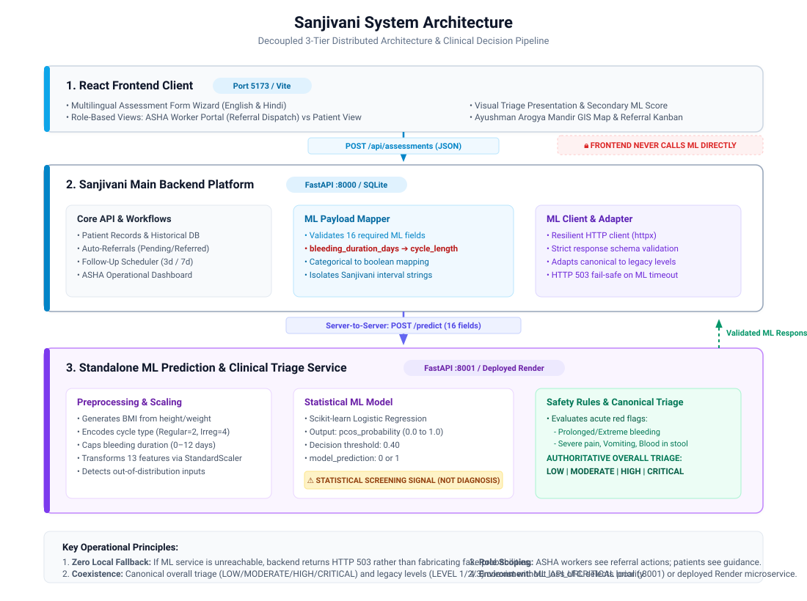

# 🩺 SANJIVANI — AI-Assisted Frontline Health Screening & Triage Platform

> **Tagline:** *"From Every ASHA, A New Asha."*  
> **Architecture:** Decoupled 3-Tier Distributed System (Frontend ➔ Main Backend ➔ Standalone ML Microservice)

---

## 📌 Executive Overview

**SANJIVANI** is an AI-assisted women’s health triage, early-risk identification, referral, and follow-up decision support platform designed specifically for Accredited Social Health Activists (**ASHA Workers**) and women in frontline healthcare settings across India.

> ⚠️ **IMPORTANT CLINICAL DISCLAIMER:**  
> SANJIVANI is **NOT a diagnostic application** and does not provide standalone medical diagnoses. The platform provides structured, evidence-based triage recommendations (*LOW*, *MODERATE*, *HIGH*, *CRITICAL*) to support frontline workers in making timely clinical referrals.

---

## 📖 Detailed System & ML Architecture Guide

For deep-dive documentation on request/response data flows, the 13-feature ML model, deterministic safety rules, semantic cycle length isolation, and failure modes, see:

👉 **[SANJIVANI_SYSTEM_README.md](SANJIVANI_SYSTEM_README.md)**

---

## 🏗️ System Architecture



---

## Live Production Deployment

| Component | Production URL | Purpose |
|---|---|---|
| Frontend | https://sanjivani-frontend-sand.vercel.app/ | User-facing React/Vite application |
| Main Backend | https://sanjivani-main-backend.onrender.com | Central Sanjivani application API |
| Main Backend Swagger | https://sanjivani-main-backend.onrender.com/docs | API documentation/testing |
| Main Backend Health | https://sanjivani-main-backend.onrender.com/health | Backend monitoring |
| ML Service | https://sanjivani-backend-hlvg.onrender.com | Standalone Logistic Regression + safety/triage service |
| ML Health | https://sanjivani-backend-hlvg.onrender.com/health | ML service monitoring |
| ML Predict | https://sanjivani-backend-hlvg.onrender.com/predict | Internal prediction endpoint called by the main backend |

### Production Data-Flow Architecture

```text
User / ASHA / Patient
        │
        ▼
Frontend — Vercel
https://sanjivani-frontend-sand.vercel.app/
        │
        │ /api/*
        ▼
Main Backend — Render
https://sanjivani-main-backend.onrender.com
        │
        │ POST /predict
        ▼
Standalone ML Service — Render
https://sanjivani-backend-hlvg.onrender.com
        │
        ├── Logistic Regression
        └── Safety / Red Flag Rules
        │
        ▼
LOW / MODERATE / HIGH / CRITICAL
        │
        ▼
Main Backend
        │
        ├── Database
        ├── Referral
        └── Follow-up
        │
        ▼
Frontend Result Screen
```

#### Key Architecture & Integration Rules:
- **Frontend Isolation:** The frontend communicates strictly with the **Main Backend**. The frontend must **NOT** call the ML `/predict` endpoint directly.
- **Persistence & Coordination:** The Main Backend is the central API gateway, patient registry, and workflow persistence layer.
- **Inference Ownership:** The Standalone ML Service exclusively owns Logistic Regression inference, feature scaling, and safety-aware triage.
- **Monitoring vs Documentation:** `/docs` is Swagger interactive documentation, not a health probe. `/health` must be used for uptime monitoring.

---

## Production Monitoring

Recommended UptimeRobot / Ping Monitoring Checks:

1. **Frontend:** `GET https://sanjivani-frontend-sand.vercel.app/`
2. **Main Backend:** `GET https://sanjivani-main-backend.onrender.com/health`
3. **ML Service:** `GET https://sanjivani-backend-hlvg.onrender.com/health`

**Expected Result for all monitors:** `HTTP 200`


---

## 🛡️ Ownership Boundaries & Responsibilities

| Responsibility | Frontend (`frontend/`) | Main Backend (`backend/`) | ML Service (`ml-service/`) |
|---|:---:|:---:|:---:|
| User Interface & Step-wise Forms | ✅ | ❌ | ❌ |
| Patient History & DB Persistence | ❌ | ✅ | ❌ |
| Referral & Follow-up Workflows | ❌ | ✅ | ❌ |
| ASHA Dashboard & Analytics | ❌ | ✅ | ❌ |
| Payload Mapping & Legacy Adapters | ❌ | ✅ | ❌ |
| Machine Learning Preprocessing | ❌ | ❌ | ✅ |
| Logistic Regression Inference | ❌ | ❌ | ✅ |
| Deterministic Clinical Safety Rules | ❌ | ❌ | ✅ |
| Authoritative Canonical Triage | ❌ | ❌ | ✅ |

---

## 📡 API Contracts & Integration

### 1. Frontend ➔ Main Backend: `POST /api/assessments`

#### Required Request Payload:
```json
{
  "patient_code": "PAT-1089",
  "age": 24,
  "height_cm": 158.0,
  "weight_kg": 55.0,
  "weight_gain": false,
  "cycle_length": "21-35 days",
  "cycle_regularity": "Regular",
  "bleeding_duration_days": 4,
  "heavy_bleeding": false,
  "symptom_duration": "1-3 months",
  "facial_hair": false,
  "acne": false,
  "hair_loss": false,
  "dark_skin": false,
  "thyroid": "No",
  "diabetes": "No",
  "family_pcos": "No",
  "existing_pcos_diagnosis": "Not diagnosed",
  "fast_food": "Rarely",
  "exercise": "Regularly",
  "diet_quality": "Adequate daily meals",
  "diarrhea": false,
  "stomach_pain": false,
  "vomiting": false,
  "bloating": false,
  "blood_in_stool": false,
  "pain_severity": 1,
  "pain_location": "None",
  "wellbeing": "Calm / Stable",
  "submitted_by_role": "ASHA"
}
```

> ⚠️ **CRITICAL SEMANTIC CYCLE-LENGTH DISTINCTION:**  
> In Sanjivani, `cycle_length` represents the **menstrual cycle interval** (e.g. `"21-35 days"`).  
> In the ML Prediction Service, `cycle_length` represents the **bleeding duration in days**.  
> The integration layer strictly maps `bleeding_duration_days` ➔ `cycle_length`. The menstrual interval string is **never** sent to the ML service.

---

### 2. Main Backend ➔ ML Service: `POST /predict`

#### Exact Field Mapping:
| Sanjivani Input Field | ML Service Field | Mapping Rule / Transformation |
|---|---|---|
| `age` | `age` | Direct integer |
| `weight_kg` | `weight` | Direct float |
| `height_cm` | `height` | Direct float |
| `cycle_regularity` | `cycle_type` | `"Regular"` ➔ `"regular"`, `"Irregular"`/`"Frequently missed"` ➔ `"irregular"` |
| `bleeding_duration_days` | `cycle_length` | Direct integer (1 to 100 days) |
| `weight_gain` | `weight_gain` | Boolean |
| `facial_hair` | `hair_growth` | Boolean |
| `dark_skin` | `skin_darkening` | Boolean |
| `hair_loss` | `hair_loss` | Boolean |
| `acne` | `pimples` | Boolean |
| `fast_food` | `fast_food` | `"Frequently"` ➔ `true`, `"Rarely"`/`"Sometimes"` ➔ `false` |
| `exercise` | `regular_exercise` | `"Regularly"` ➔ `true`, `"Occasionally"`/`"Rarely/Never"` ➔ `false` |
| `heavy_bleeding` | `heavy_bleeding` | Boolean |
| `pain_severity` | `severe_pain` | `pain_severity >= 4` ➔ `true`, else `false` |
| `blood_in_stool` | `blood_in_stool` | Boolean |
| `vomiting` | `vomiting` | Boolean |

---

### 3. Canonical Triage vs. Legacy Platform Compatibility

The Standalone ML service is authoritative. Its canonical overall result is:
- **`LOW`** ➔ Legacy compatibility: `LEVEL 1` (Routine care, no auto-referral)
- **`MODERATE`** ➔ Legacy compatibility: `LEVEL 2` (Auto-referral, 7-day follow-up)
- **`HIGH`** ➔ Legacy compatibility: `LEVEL 3` (Auto-referral, 3-day urgent follow-up)
- **`CRITICAL`** ➔ Legacy compatibility: `LEVEL 3` (Auto-referral, 3-day urgent follow-up, `overall_prediction = "CRITICAL"`)

> `CRITICAL` is never downgraded to `HIGH`. Both canonical `CRITICAL` and legacy `LEVEL 3` coexist in the database and API responses.

---

## ⚙️ Environment Configuration

### Main Backend Configuration (`backend/.env`):
```env
# Standalone ML Prediction & Triage Microservice URL
# (Required in production/staging; defaults to localhost in development)
ML_API_URL=http://127.0.0.1:8001/predict

# Request timeout in seconds for communication with ML service
ML_API_TIMEOUT=5.0

# Deployment environment (development | staging | production)
ENVIRONMENT=development

# Admin secret token for model governance endpoint (/api/ml/metrics)
# (Required in production/staging; endpoint disabled if unset)
ADMIN_API_TOKEN=your_secure_admin_token_here
```

> **Production / Staging Requirements:**
> - `ML_API_URL` is **mandatory**. If omitted, the Main Backend fails fast with a configuration error rather than silently defaulting to localhost.
> - `ADMIN_API_TOKEN` is **mandatory** to access the `/api/ml/metrics` admin governance endpoint. If omitted, the endpoint safely returns `HTTP 503`.

---

## 🚀 Local Development Startup Guide

Run each tier in a dedicated terminal window:

### Terminal 1 — Standalone ML Microservice (Port 8001)
```bash
cd ml-service
python -m uvicorn main:app --host 127.0.0.1 --port 8001 --reload
```
*Health Check: `curl http://127.0.0.1:8001/health`*

### Terminal 2 — Main Sanjivani Backend (Port 8000)
```bash
cd backend
python database/init_db.py  # Run safe SQLite migrations

ML_API_URL=http://127.0.0.1:8001/predict \
ML_API_TIMEOUT=5.0 \
ENVIRONMENT=development \
ADMIN_API_TOKEN=your_local_dev_token \
python -m uvicorn main:app --host 127.0.0.1 --port 8000 --reload
```
*Health Check: `curl http://127.0.0.1:8000/health`*  
*Live Stats Check: `curl http://127.0.0.1:8000/api/dashboard/stats`*

### Terminal 3 — React Vite Frontend (Port 5173)
```bash
cd frontend
npm install
npm run dev
```
*Access UI at `http://127.0.0.1:5173`*

---

## 🧪 Automated Test Suites

Run all automated unit and integration tests across the workspace:

```bash
# 1. Main Backend Test Suite (39 tests)
python -m unittest discover backend/tests

# 2. Standalone ML Microservice Test Suite (13 tests)
cd ml-service && python -m unittest discover tests && cd ..

# 3. Frontend Production Build
cd frontend && npm run build && cd ..
```

---

## 🔒 Security & Privacy Governance

1. **Role-Based Isolation**: Clinical action buttons (*Dispatch Referral*, *Schedule Follow-up*) are strictly hidden in the Patient self-assessment portal and accessible only to authenticated ASHA Workers.
2. **Zero Direct ML Exposure**: The frontend client never connects directly to port `8001`. All requests are mediated, validated, and logged by the Main Backend.
3. **No Local Inference Fallback**: If the ML service is down or unreachable, the system returns `HTTP 503 Service Unavailable` without fabricating fake probabilities or fake Level 1 results.
