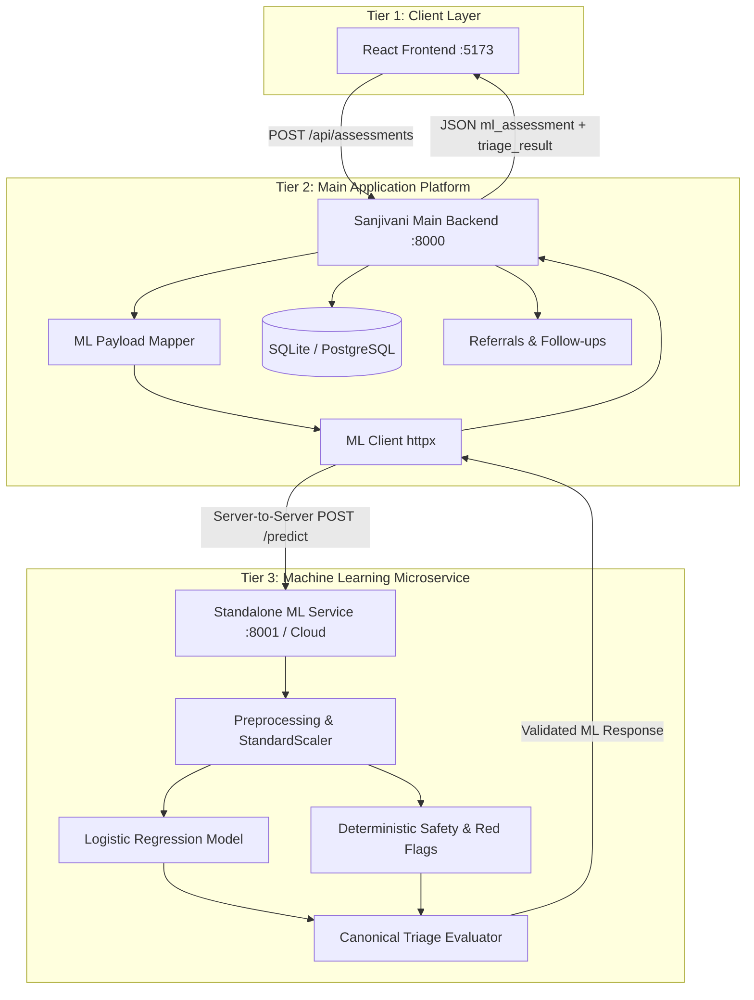
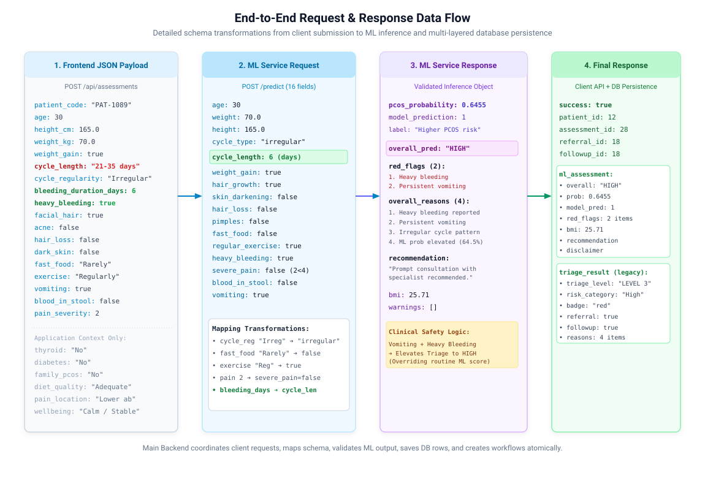
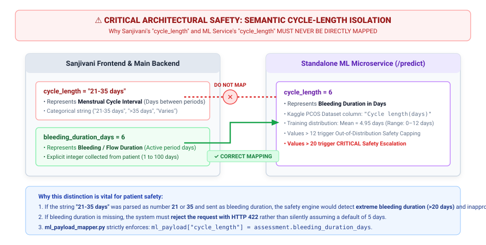
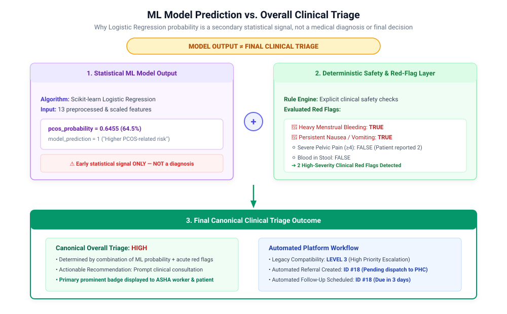
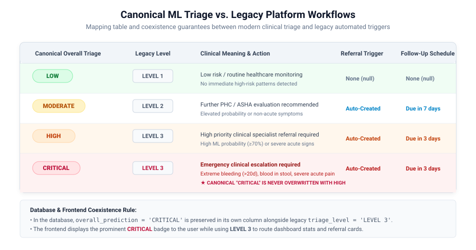
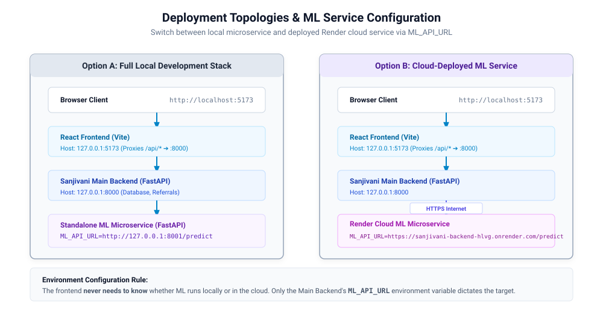

# 🩺 Sanjivani
## System Architecture, Data Flow & ML Interpretation Guide

> **Production Engineering Documentation**  
> Comprehensive reference for developers, evaluators, clinical auditors, and integrators.

---

## Table of Contents
1. [What Sanjivani Does](#1-what-sanjivani-does)
2. [Architecture at a Glance](#2-architecture-at-a-glance)
3. [Component Responsibilities](#3-component-responsibilities)
4. [End-to-End Data Flow](#4-end-to-end-data-flow)
5. [Field Mapping: ML Features vs. Application Context](#5-field-mapping-ml-features-vs-application-context)
6. [Critical `cycle_length` Semantic Mapping](#6-critical-cycle_length-semantic-mapping)
7. [How the ML Model Works in the System](#7-how-the-ml-model-works-in-the-system)
8. [ML Prediction vs. Overall Clinical Triage](#8-ml-prediction-vs-overall-clinical-triage)
9. [Safety & Red-Flag Layer](#9-safety--red-flag-layer)
10. [Canonical vs. Legacy Triage Coexistence](#10-canonical-vs-legacy-triage-coexistence)
11. [End-to-End Synthetic Assessment Walkthrough](#11-end-to-end-synthetic-assessment-walkthrough)
12. [How to Read and Interpret the API Response](#12-how-to-read-and-interpret-the-api-response)
13. [Database Persistence & Schema Integrity](#13-database-persistence--schema-integrity)
14. [Failure Handling & Zero-Fallback Resilience](#14-failure-handling--zero-fallback-resilience)
15. [Local Development Topologies](#15-local-development-topologies)
16. [Local ML vs. Cloud-Deployed ML Service](#16-local-ml-vs-cloud-deployed-ml-service)
17. [Running the Complete Stack (Python 3.11 + uv)](#17-running-the-complete-stack-python-311--uv)
18. [Debugging & Health Verification](#18-debugging--health-verification)
19. [How to Verify the ML Model Is Actually Running](#19-how-to-verify-the-ml-model-is-actually-running)
20. [Important Architectural Rules](#20-important-architectural-rules)

---

## 1. What Sanjivani Does

**Sanjivani** is an AI-assisted women's health screening, clinical triage, referral coordination, and follow-up tracking platform designed for Accredited Social Health Activists (**ASHA Workers**) and frontline healthcare providers in low-resource public health settings across India.

### Core Capabilities:
- **Multilingual Frontline Screening:** Enables ASHA workers and patients to input step-wise clinical, metabolic, menstrual, and endocrine observations.
- **Microservice-Powered Statistical ML Risk Scoring:** Predicts statistical PCOS-related risk probability using a trained Scikit-learn Logistic Regression model.
- **Deterministic Clinical Safety Rules:** Evaluates acute red-flag conditions (e.g., extreme bleeding duration, heavy bleeding, severe pelvic pain, vomiting, blood in stool).
- **Authoritative Clinical Triage:** Classifies patients into canonical categories (`LOW`, `MODERATE`, `HIGH`, `CRITICAL`) with plain-language recommendations and clinical rationales.
- **Closed-Loop Referral & Follow-Up Workflows:** Automatically dispatches digital referrals to Ayushman Arogya Mandirs (Primary Health Centres) and schedules 3-day or 7-day ASHA home follow-ups.

> ⚠️ **CLINICAL NOTICE:** Sanjivani is an **early screening and triage decision-support tool**, not a medical diagnostic device. It does not provide definitive medical diagnoses.

---

## 2. Architecture at a Glance

The platform uses a **decoupled 3-tier distributed microservices architecture**. The React frontend communicates strictly with the Main Backend, which acts as the API gateway and coordinator to the Standalone ML Prediction Microservice.


### High-Level Topology:


> 🔒 **ISOLATION GUARANTEE:** The browser client **NEVER** calls the ML microservice directly. All prediction traffic is server-to-server, authenticated, validated, and logged by the Main Backend.

---

## 3. Component Responsibilities

| Responsibility Domain | Frontend (`frontend/`) | Main Backend (`backend/`) | Standalone ML (`ml-service/`) |
|---|:---:|:---:|:---:|
| **User Interface & Wizard Forms** | ✅ **Exclusive** | ❌ | ❌ |
| **Role-Based Views (ASHA vs. Patient)** | ✅ **Exclusive** | ❌ | ❌ |
| **Patient History & Record Persistence** | ❌ | ✅ **Exclusive** | ❌ |
| **Referral Dispatch & Kanban Tracking** | ❌ | ✅ **Exclusive** | ❌ |
| **Follow-Up Scheduling & Tracking** | ❌ | ✅ **Exclusive** | ❌ |
| **Payload Mapping & Adaptation** | ❌ | ✅ **Exclusive** | ❌ |
| **13-Feature Preprocessing & Scaling** | ❌ | ❌ | ✅ **Exclusive** |
| **Logistic Regression Inference** | ❌ | ❌ | ✅ **Exclusive** |
| **Deterministic Clinical Red-Flag Rules** | ❌ | ❌ | ✅ **Exclusive** |
| **Authoritative Canonical Triage** | ❌ | ❌ | ✅ **Exclusive** |

---

## 4. End-to-End Data Flow

The following sequence details how a single assessment progresses from user input to ML feature extraction, rule evaluation, database persistence, and user presentation:



### Lifecycle Stages:
1. **Submission (`POST /api/assessments`):** Client submits patient demographics, menstrual history, symptoms, and acute pain indicators to the Main Backend on port `8000`.
2. **Mapping (`ml_payload_mapper.py`):** Backend extracts 16 standardized fields, maps categorical options to booleans, and strictly maps `bleeding_duration_days` to `cycle_length`.
3. **ML Request (`POST /predict`):** Backend calls `http://127.0.0.1:8001/predict` (or the configured cloud endpoint) with the 16-field payload over HTTP using `httpx`.
4. **ML Inference & Safety Evaluation (`ml-service`):**
   - Preprocessing computes BMI and scales 13 numerical features via `StandardScaler`.
   - Logistic Regression calculates `pcos_probability` (0.0 to 1.0) and assigns binary `model_prediction`.
   - Safety rule engine independently checks acute red flags.
   - Overall triage algorithm synthesizes ML score + safety flags into canonical `overall_prediction` (`LOW`, `MODERATE`, `HIGH`, `CRITICAL`).
5. **Persistence & Adaptation (`ml_response_adapter.py`):**
   - Backend saves canonical ML fields and legacy fields in the `assessments` SQLite table.
   - For `LEVEL 2` / `LEVEL 3`, auto-generates `Referral` and `FollowUp` records atomically.
6. **Client Presentation:** UI renders the prominent canonical triage badge, actionable guidance, structured red-flag alerts, and secondary ML probability indicators.

---

## 5. Field Mapping: ML Features vs. Application Context

Not every field collected in the Sanjivani assessment wizard is fed into the ML model. The system strictly separates **statistical features**, **safety rule inputs**, and **application-only medical context**.

### A. Fields Used by ML Model & Preprocessing (13 Features):
| Sanjivani Input Field | ML Service Field | ML Model Feature Name | Transformation / Encoding |
|---|---|---|---|
| `age` | `age` | ` Age (yrs)` | Integer (10–100) |
| `weight_kg` | `weight` | `Weight (Kg)` | Float (kg) |
| `height_cm` | `height` | `Height(Cm) ` | Float (cm) |
| *(Calculated)* | *(Calculated)* | `BMI` | `weight_kg / ((height_cm/100)^2)` |
| `cycle_regularity` | `cycle_type` | `Cycle(R/I)` | `"Regular"` ➔ `2`, `"Irregular"`/`"Frequently missed"` ➔ `4` |
| `bleeding_duration_days` | `cycle_length` | `Cycle length(days)` | Integer (days), capped `[0, 12]` for model scaling |
| `weight_gain` | `weight_gain` | `Weight gain(Y/N)` | Boolean ➔ `1` / `0` |
| `facial_hair` | `hair_growth` | `hair growth(Y/N)` | Boolean ➔ `1` / `0` |
| `dark_skin` | `skin_darkening` | `Skin darkening (Y/N)` | Boolean ➔ `1` / `0` |
| `hair_loss` | `hair_loss` | `Hair loss(Y/N)` | Boolean ➔ `1` / `0` |
| `acne` | `pimples` | `Pimples(Y/N)` | Boolean ➔ `1` / `0` |
| `fast_food` | `fast_food` | `Fast food (Y/N)` | `"Frequently"` ➔ `1`, `"Rarely"`/`"Sometimes"` ➔ `0` |
| `exercise` | `regular_exercise` | `Reg.Exercise(Y/N)` | `"Regularly"` ➔ `1`, `"Occasionally"`/`"Rarely/Never"` ➔ `0` |

### B. Acute Fields Used Exclusively by Safety Rules & Triage:
| Sanjivani Input Field | ML Service Field | Clinical Safety Purpose |
|---|---|---|
| `heavy_bleeding` | `heavy_bleeding` | High-severity bleeding red flag; triggers MODERATE/HIGH triage |
| `pain_severity` | `severe_pain` | `pain_severity >= 4` ➔ `true` (Severe pelvic/abdominal pain red flag) |
| `vomiting` | `vomiting` | Acute nausea/vomiting red flag; triggers prompt clinical referral |
| `blood_in_stool` | `blood_in_stool` | Critical gastrointestinal red flag; triggers emergency escalation |

### C. Application-Only Fields (Stored for ASHA Review, NOT Sent to ML):
- `patient_code`, `patient_name`, `submitted_by_role` (Registry indexing)
- `cycle_length` (Menstrual cycle interval string e.g., `"21-35 days"`)
- `symptom_duration` (`"1-3 months"`, `">1 year"`)
- `thyroid`, `diabetes`, `family_pcos`, `existing_pcos_diagnosis` (Medical history context)
- `diet_quality` (`"Adequate daily meals"`)
- `diarrhea`, `stomach_pain`, `bloating`, `pain_location`, `wellbeing` (General health context)

---

## 6. Critical `cycle_length` Semantic Mapping

> 🚨 **HIGH-PRIORITY ARCHITECTURAL WARNING**  
> A critical semantic difference exists between Sanjivani and the ML microservice regarding the term `cycle_length`.



### The Semantic Conflict:
- **In Sanjivani:** `cycle_length` refers to the **Menstrual Cycle Interval** (the number of days between periods, represented as strings like `"21-35 days"`, `">35 days"`, or `"Varies significantly"`).
- **In ML Service:** `cycle_length` refers to the **Active Menstrual Bleeding Duration in Days** (derived from the Kaggle dataset column `"Cycle length(days)"`, with a training mean of 4.95 days).

### Why Direct Mapping Causes Severe Clinical Inaccuracies:
If `"21-35 days"` was parsed as integer `21` or `35` and sent to the ML service, the safety engine would flag an **extreme prolonged bleeding duration (>20 days)** and trigger a false **CRITICAL EMERGENCY TRIAGE** for a healthy patient.

### Enforced Solution:
```python
# backend/services/ml_payload_mapper.py
ml_payload = {
    # ...
    # STRICT: Map explicit bleeding duration to ML cycle_length
    "cycle_length": int(assessment.bleeding_duration_days),
    # ...
}
```
The Sanjivani `cycle_length` interval string is **strictly excluded** from ML payload mapping.

---

## 7. How the ML Model Works in the System

```text
16-Field JSON Payload
        ↓
Feature Preprocessing (BMI calculation, Encoding)
        ↓
13 Feature Vector
        ↓
StandardScaler (Trained Means & Scales)
        ↓
LogisticRegression (Decision Threshold: 0.40)
        ↓
Raw ML Output:
  • pcos_probability: 0.6455 (64.5%)
  • model_prediction: 1 ("Higher PCOS-related risk")
```

- **Algorithm:** Scikit-learn `LogisticRegression(max_iter=500, random_state=42)`.
- **Feature Scaling:** `StandardScaler` fitted on 13 features from survey research and Kaggle dataset records.
- **Decision Threshold:** `0.40` (optimized for high sensitivity in frontline screening).
- **Out-of-Distribution Handling:** If `cycle_length` exceeds the model training range (`0–12 days`), the preprocessor caps the value at `12` for the model while attaching an explicit warning (`warnings_json`), allowing the safety rules to handle prolonged bleeding without mathematical distortion.

---

## 8. ML Prediction vs. Overall Clinical Triage

The Machine Learning model is **NOT** the final clinical decision-maker. The final triage recommendation is produced by combining statistical probability with deterministic safety rules:



```text
┌────────────────────────────────────────┐       ┌────────────────────────────────────────┐
│     Statistical ML Model Output        │   +   │   Deterministic Clinical Safety Rules  │
│  • pcos_probability: 0.6455 (64.5%)    │       │  • Heavy Bleeding: TRUE (Red Flag)     │
│  • model_prediction: 1                 │       │  • Persistent Vomiting: TRUE (Red Flag)│
└───────────────────┬────────────────────┘       └───────────────────┬────────────────────┘
                    │                                                │
                    └───────────────────────┬────────────────────────┘
                                            ▼
                        ┌────────────────────────────────────────┐
                        │   Authoritative Overall Triage: HIGH   │
                        │  Action: Prompt Specialist Referral   │
                        └────────────────────────────────────────┘
```

## 8. ML-Based PCOS Screening with a Lightweight Safety Guardrail

> 🎯 **EXPLAINABLE ML-FIRST ARCHITECTURE:**  
> **The Logistic Regression model performs the primary PCOS-related risk screening using trained clinical and lifestyle features.**  
> 
> A small deterministic safety layer checks a few already-collected high-risk symptoms such as prolonged bleeding, heavy bleeding, severe pain, vomiting, and blood in stool.
> 
> - **Primary Inference**: The Scikit-learn Logistic Regression model evaluates 13 features to produce `pcos_probability`, `model_prediction`, and `model_prediction_label`.
> - **Guardrail Escalation**: The safety guardrail can **only escalate** the result (e.g. from `LOW` to `HIGH` or `CRITICAL`) and **never downgrades** it.
> - **Zero-Fabrication Guarantee**: The safety layer never alters or fabricates the model's actual probability (e.g. `pcos_probability` remains genuine).
> - **User-Facing UI**: Normal users see clean, human-readable clinical triage categories (`LOW`, `MODERATE`, `HIGH`, `CRITICAL`), key findings, and recommended actions. Raw model probability percentages and model jargon are hidden from user UI but preserved internally for audit logs, research, and governance.

---

## 9. Lightweight Safety Guardrail

The safety layer in `ml-service/app/safety_rules.py` evaluates only existing patient inputs:

### A. Menstrual Bleeding Duration (`bleeding_duration_days` ➔ ML `cycle_length`)
- **1–7 days:** Normal baseline duration (no duration-only escalation).
- **8–10 days:** Prolonged bleeding ➔ Minimum **`MODERATE`**.
- **11–20 days:** Significantly prolonged bleeding ➔ Minimum **`HIGH`**.
- **≥21 days:** Extremely prolonged bleeding ➔ Forces **`CRITICAL`** emergency triage.

### B. Existing Acute Symptoms
- **Heavy Bleeding (`heavy_bleeding = true`):** Minimum **`HIGH`**.
- **Severe Pain (`pain_severity >= 4` ➔ `severe_pain = true`):** Minimum **`HIGH`**.
  - *Critical combination:* `severe_pain` AND (`heavy_bleeding` OR `vomiting` OR `duration >= 11 days`) ➔ **`CRITICAL`**.
- **Vomiting (`vomiting = true`):** Minimum **`HIGH`**.
- **Blood in Stool (`blood_in_stool = true`):** Forces **`CRITICAL`** emergency triage.

### C. Precedence & Triage Guarantees
- Priority: **`CRITICAL` > `HIGH` > `MODERATE` > `LOW`**.
- `CRITICAL` can never be downgraded.
- All safety rules act strictly as non-diagnostic safety guardrails.

---

## 10. Canonical vs. Legacy Triage Coexistence

To support backward compatibility with Sanjivani's existing referral workflows and ASHA dashboards, the system maintains **both** canonical ML triage and legacy levels:



| Canonical Overall Triage | Legacy Triage Level | Referral Auto-Created? | Follow-Up Scheduled? | Clinical Interpretation |
|---|---|:---:|:---:|---|
| **`LOW`** | `LEVEL 1` | ❌ No (`null`) | ❌ No (`null`) | Routine health monitoring; no acute risk |
| **`MODERATE`** | `LEVEL 2` | ✅ Yes (`Pending`) | ✅ Yes (7 Days) | PHC evaluation & lifestyle consultation |
| **`HIGH`** | `LEVEL 3` | ✅ Yes (`Pending`) | ✅ Yes (3 Days) | Prompt clinical specialist referral |
| **`CRITICAL`** | `LEVEL 3` | ✅ Yes (`Pending`) | ✅ Yes (3 Days) | Urgent emergency escalation |

> ★ **PRESERVATION GUARANTEE:** `CRITICAL` is **never** renamed or downgraded to `HIGH`. Canonical `overall_prediction = 'CRITICAL'` is stored in its own dedicated database column and displayed as a high-contrast rose banner in the UI.

---

## 11. End-to-End Synthetic Assessment Walkthrough

The following example demonstrates a real end-to-end execution for synthetic patient `PAT-DOC-DEMO-001`.

### A. Client Request (`POST /api/assessments`):
```json
{
  "patient_code": "PAT-DOC-DEMO-001",
  "age": 30,
  "height_cm": 165.0,
  "weight_kg": 70.0,
  "weight_gain": true,
  "cycle_length": "21-35 days",
  "cycle_regularity": "Irregular",
  "bleeding_duration_days": 6,
  "heavy_bleeding": true,
  "symptom_duration": "1-3 months",
  "facial_hair": true,
  "acne": false,
  "hair_loss": false,
  "dark_skin": false,
  "thyroid": "No",
  "diabetes": "No",
  "family_pcos": "No",
  "existing_pcos_diagnosis": "Not diagnosed",
  "fast_food": "Rarely",
  "exercise": "Regularly",
  "diet_quality": "Adequate daily meals",
  "diarrhea": false,
  "stomach_pain": false,
  "vomiting": true,
  "bloating": false,
  "blood_in_stool": false,
  "pain_severity": 2,
  "pain_location": "Lower abdomen",
  "wellbeing": "Calm / Stable",
  "submitted_by_role": "ASHA"
}
```

### B. Mapped ML Microservice Request (`POST /predict`):
```json
{
  "age": 30,
  "weight": 70.0,
  "height": 165.0,
  "cycle_type": "irregular",
  "cycle_length": 6,
  "weight_gain": true,
  "hair_growth": true,
  "skin_darkening": false,
  "hair_loss": false,
  "pimples": false,
  "fast_food": false,
  "regular_exercise": true,
  "heavy_bleeding": true,
  "severe_pain": false,
  "blood_in_stool": false,
  "vomiting": true
}
```

### C. Live Backend Response (`HTTP 200 OK`):
```json
{
  "success": true,
  "patient_id": 12,
  "patient_code": "PAT-DOC-DEMO-001",
  "assessment_id": 28,
  "referral_id": 18,
  "followup_id": 18,
  "triage_result": {
    "triage_level": "LEVEL 3",
    "triage_code": 3,
    "title": "High Priority Clinical Referral Required",
    "title_hindi": "चिकित्सकीय परामर्श / अति आवश्यक रेफरल",
    "badge_color": "red",
    "risk_probability": 0.6455,
    "risk_category": "High Risk",
    "calculated_bmi": 25.71,
    "red_flag_triggered": true,
    "recommended_action": "Prompt consultation with a healthcare professional (such as a gynecologist or endocrinologist) is recommended.",
    "recommended_action_hindi": "",
    "reasons": [
      {
        "title": "Heavy menstrual bleeding reported.",
        "title_hindi": "",
        "category": "Clinical Indicator"
      },
      {
        "title": "Persistent nausea or vomiting reported.",
        "title_hindi": "",
        "category": "Clinical Indicator"
      },
      {
        "title": "Irregular menstrual cycle pattern reported.",
        "title_hindi": "",
        "category": "Clinical Indicator"
      },
      {
        "title": "ML model detected elevated PCOS-related risk (probability: 64.5%).",
        "title_hindi": "",
        "category": "Clinical Indicator"
      }
    ],
    "requires_referral": true,
    "requires_followup": true
  },
  "ml_assessment": {
    "ml_available": true,
    "pcos_probability": 0.6455,
    "model_prediction": 1,
    "model_prediction_label": "Higher PCOS-related risk",
    "overall_prediction": "HIGH",
    "overall_reasons": [
      "Heavy menstrual bleeding reported.",
      "Persistent nausea or vomiting reported.",
      "Irregular menstrual cycle pattern reported.",
      "ML model detected elevated PCOS-related risk (probability: 64.5%)."
    ],
    "red_flags": [
      {
        "severity": "high",
        "category": "bleeding",
        "message": "Heavy menstrual bleeding reported."
      },
      {
        "severity": "high",
        "category": "gastrointestinal",
        "message": "Persistent nausea or vomiting reported — evaluated as an acute general symptom."
      }
    ],
    "recommendation": "Prompt consultation with a healthcare professional (such as a gynecologist or endocrinologist) is recommended.",
    "warnings": [],
    "model_limitations": [],
    "bmi": 25.71,
    "disclaimer": "This is an AI-assisted early screening and triage assessment and not a medical diagnosis."
  }
}
```

---

## 12. How to Read and Interpret the API Response

The API response separates statistical indicators from clinical triage and platform actions:

```text
API Response
├── ml_assessment (Authoritative Standalone ML Service Output)
│   ├── overall_prediction    ➔ "HIGH" (Primary Clinical Triage)
│   ├── pcos_probability      ➔ 0.6455 (Secondary Statistical Model Score: 64.5%)
│   ├── model_prediction      ➔ 1 (Binary threshold: 0=Lower risk, 1=Higher risk)
│   ├── model_prediction_label➔ "Higher PCOS-related risk"
│   ├── red_flags             ➔ Array of acute clinical concerns (Bleeding, Vomiting)
│   ├── overall_reasons       ➔ Plain-language rationales for healthcare workers
│   ├── recommendation        ➔ Actionable next-step clinical advice
│   └── disclaimer            ➔ Mandatory non-diagnostic advisory
├── triage_result (Legacy Platform Compatibility Object)
│   ├── triage_level          ➔ "LEVEL 3" (Routes ASHA dashboard KPIs & Kanban)
│   └── risk_category         ➔ "High Risk"
└── Workflow Identifiers
    ├── referral_id           ➔ 18 (Pending digital referral to Ayushman Mandir)
    └── followup_id           ➔ 18 (Automated 3-day home visit reminder)
```

---

## 13. Database Persistence & Schema Integrity

All assessment records are stored in SQLite (`backend/sanjivani.db`) with full backward and forward compatibility.

```text
Table: assessments
├── Legacy Columns (Maintained for dashboard & historical query compatibility)
│   ├── id, patient_id, timestamp, risk_probability, risk_category, triage_level, red_flag_triggered, reasons_json
├── Input Columns (Required for accurate clinical screening)
│   ├── bleeding_duration_days (INTEGER)
│   └── heavy_bleeding (BOOLEAN)
└── Canonical ML Columns (Persisted directly from ML microservice)
    ├── ml_available (BOOLEAN)
    ├── ml_error (VARCHAR)
    ├── pcos_probability (FLOAT)
    ├── model_prediction (INTEGER)
    ├── model_prediction_label (VARCHAR)
    ├── overall_prediction (VARCHAR: 'LOW' | 'MODERATE' | 'HIGH' | 'CRITICAL')
    ├── overall_reasons_json (TEXT)
    ├── red_flags_json (TEXT)
    ├── recommendation (TEXT)
    ├── warnings_json (TEXT)
    ├── model_limitations_json (TEXT)
    └── disclaimer (TEXT)
```

- **Non-Destructive Migration:** `backend/database/init_db.py` inspects the SQLite table using PRAGMA table information and issues `ALTER TABLE ADD COLUMN` queries dynamically for missing columns.
- **Historical Data Safety:** Older records without ML data retain authentic `NULL` values without breaking queries or synthesizing fake Logistic Regression scores.

---

## 14. Failure Handling & Zero-Fallback Resilience

Sanjivani strictly forbids silent local fallback inference.

```text
ML Microservice Unreachable / Timeout (>5s) / Malformed Response
                           ↓
              backend/services/ml_client.py
                           ↓
            Raises MLClientError / MLTimeoutError
                           ↓
               backend/main.py Exception Handler
                           ↓
                  HTTP 503 Service Unavailable
             ("ML Prediction Service is currently unavailable")
                           ↓
                 DB Transaction Rolled Back:
          • Zero assessment records persisted
          • Zero fake referrals created
          • Zero fake probabilities returned
```

### Standard Error Responses:
- **`HTTP 422 Unprocessable Entity`:** Missing required input (e.g., omitted `bleeding_duration_days` or `heavy_bleeding`, out-of-range age or weight).
- **`HTTP 503 Service Unavailable`:** Standalone ML microservice connection refused, request timed out, or returned invalid JSON.
- **`HTTP 403 Forbidden`:** Missing or invalid `X-Admin-Token` when requesting `/api/ml/metrics`.

---

## 15. Local Development Topologies

Developers can run Sanjivani in either a **Full Local Stack** or a **Hybrid Cloud ML Stack**:



---

## 16. Local ML vs. Cloud-Deployed ML Service

The Main Backend seamlessly switches between local inference and deployed cloud inference through a single environment variable:

### Local Microservice Mode:
```env
# backend/.env
DATABASE_URL=sqlite:///./sanjivani.db
ML_API_URL=http://127.0.0.1:8001/predict
ML_API_TIMEOUT=5.0
ENVIRONMENT=development
ADMIN_API_TOKEN=SANJIVANI_ADMIN_SECRET_2026
```

### Deployed Cloud Microservice Mode (Render Persistent Disk):
```env
# backend/.env
# On Render with Persistent Disk mounted at /var/data:
DATABASE_URL=sqlite:////var/data/sanjivani.db
ML_API_URL=https://sanjivani-backend-hlvg.onrender.com/predict
ML_API_TIMEOUT=15.0
ENVIRONMENT=production
ADMIN_API_TOKEN=your_production_secure_token
```

### Live Production Deployment

| Component | Production URL | Purpose |
|---|---|---|
| Frontend | https://sanjivani-frontend-sand.vercel.app/ | User-facing React/Vite application |
| Main Backend | https://sanjivani-main-backend.onrender.com | Central Sanjivani application API |
| Main Backend Swagger | https://sanjivani-main-backend.onrender.com/docs | API documentation/testing |
| Main Backend Health | https://sanjivani-main-backend.onrender.com/health | Backend monitoring |
| ML Service | https://sanjivani-backend-hlvg.onrender.com | Standalone Logistic Regression + safety/triage service |
| ML Health | https://sanjivani-backend-hlvg.onrender.com/health | ML service monitoring |
| ML Predict | https://sanjivani-backend-hlvg.onrender.com/predict | Internal prediction endpoint called by the main backend |

### Production Request Pipeline

```text
User / ASHA / Patient
        │
        ▼
Frontend — Vercel
https://sanjivani-frontend-sand.vercel.app/
        │
        │ /api/*
        ▼
Main Backend — Render
https://sanjivani-main-backend.onrender.com
        │
        │ POST /predict
        ▼
Standalone ML Service — Render
https://sanjivani-backend-hlvg.onrender.com
        │
        ├── Logistic Regression
        └── Safety / Red Flag Rules
        │
        ▼
LOW / MODERATE / HIGH / CRITICAL
        │
        ▼
Main Backend
        │
        ├── Database
        ├── Referral
        └── Follow-up
        │
        ▼
Frontend Result Screen
```

#### Key Architecture & Integration Rules:
- **Frontend Isolation:** The frontend communicates strictly with the **Main Backend**. The frontend must **NOT** call the ML `/predict` endpoint directly.
- **Persistence & Coordination:** The Main Backend is the central API gateway, patient registry, and workflow persistence layer.
- **Inference Ownership:** The Standalone ML Service exclusively owns Logistic Regression inference, feature scaling, and safety-aware triage.
- **Monitoring vs Documentation:** `/docs` is Swagger interactive documentation, not a health probe. `/health` must be used for uptime monitoring.

### Production Monitoring

Recommended UptimeRobot / Ping Monitoring Checks:

1. **Frontend:** `GET https://sanjivani-frontend-sand.vercel.app/`
2. **Main Backend:** `GET https://sanjivani-main-backend.onrender.com/health`
3. **ML Service:** `GET https://sanjivani-backend-hlvg.onrender.com/health`

**Expected Result for all monitors:** `HTTP 200`

> **Production Configuration Rules:**
> 1. When `ENVIRONMENT=production` or `staging`, `ML_API_URL` is mandatory. The application will fail-fast with a configuration error on startup if `ML_API_URL` is omitted.
> 2. For persistent SQLite storage on Render, attach a Persistent Disk at `/var/data` and configure `DATABASE_URL=sqlite:////var/data/sanjivani.db`. Default when unset is local `./sanjivani.db`.

---

## 17. Running the Complete Stack (Python 3.11 + uv)

### Prerequisites:
- Python 3.11 (`uv` recommended)
- Node.js 18+ and `npm`

---

### Terminal 1 — Standalone ML Microservice (Port 8001)
```bash
cd ml-service

# Create and activate Python 3.11 virtual environment
uv venv --python 3.11 .venv
source .venv/bin/activate

# Install dependencies
uv pip install -r requirements.txt

# Start ML FastAPI daemon
PYTHONPATH=. python -m uvicorn main:app --host 127.0.0.1 --port 8001 --reload --reload-dir app
```
*Health Check:* `curl http://127.0.0.1:8001/health`

---

### Terminal 2 — Main Sanjivani Backend (Port 8000)
```bash
cd backend

# Create and activate Python 3.11 virtual environment
uv venv --python 3.11 .venv
source .venv/bin/activate

# Install dependencies
uv pip install -r requirements.txt

# Run safe database migrations
PYTHONPATH=. python database/init_db.py

# Configure environment variables
export ENVIRONMENT=development
export ML_API_URL=http://127.0.0.1:8001/predict
export ML_API_TIMEOUT=5.0
export ADMIN_API_TOKEN=SANJIVANI_ADMIN_SECRET_2026

# Start Main Backend FastAPI daemon
PYTHONPATH=. python -m uvicorn main:app --host 127.0.0.1 --port 8000 --reload
```
*Stats Check:* `curl http://127.0.0.1:8000/api/dashboard/stats`

---

### Terminal 3 — React Vite Frontend (Port 5173)
```bash
cd frontend

# Install Node dependencies
npm install

# Start Vite dev server
npm run dev -- --host 127.0.0.1 --port 5173
```
*Access Web App:* `http://127.0.0.1:5173`

---

## 18. Debugging & Health Verification

### Quick Health Verification Endpoints:

#### 1. Main Backend Process & DB Connectivity Health (`GET /health`):
- **Local:** `http://127.0.0.1:8000/health`
- **Production:** `https://<main-backend-domain>/health`
```bash
curl -s http://127.0.0.1:8000/health | jq .

# Expected Output:
# {
#   "status": "healthy",
#   "service": "sanjivani-main-backend",
#   "database": "connected"
# }
```

#### 2. Standalone ML Service & Model Health (`GET /health`):
- **Local:** `http://127.0.0.1:8001/health`
- **Production:** `https://sanjivani-backend-hlvg.onrender.com/health`
```bash
curl -s http://127.0.0.1:8001/health | jq .

# Expected Output:
# {
#   "status": "healthy",
#   "model_loaded": true,
#   "version": "1.0.0"
# }
```

#### 3. Main Backend Dashboard Stats:
```bash
curl -s http://127.0.0.1:8000/api/dashboard/stats | jq .kpis
```
curl -s http://127.0.0.1:8000/api/dashboard/stats | jq .kpis

# 3. Check All Active Listeners
lsof -nP -iTCP:5173,8000,8001 -sTCP:LISTEN
```

### Running Automated Test Suites:
```bash
# Run all Main Backend unit & integration tests (42 tests)
python -m unittest discover backend/tests

# Run all ML Microservice unit tests (13 tests)
cd ml-service && python -m unittest discover tests && cd ..

# Validate Frontend Production Bundle
cd frontend && npm run build && cd ..
```

---

## 19. How to Verify the ML Model Is Actually Running

1. **Interactive OpenAPI / Swagger Documentation:**
   - Standalone ML Service: Navigate to `http://127.0.0.1:8001/docs`
   - Main Backend API: Navigate to `http://127.0.0.1:8000/docs`
2. **Direct ML Test via curl:**
   ```bash
   curl -X POST http://127.0.0.1:8001/predict \
     -H "Content-Type: application/json" \
     -d '{
       "age": 25, "weight": 55.0, "height": 158.0,
       "cycle_type": "regular", "cycle_length": 4,
       "weight_gain": false, "hair_growth": false,
       "skin_darkening": false, "hair_loss": false,
       "pimples": false, "fast_food": false,
       "regular_exercise": true, "heavy_bleeding": false,
       "severe_pain": false, "blood_in_stool": false,
       "vomiting": false
     }' | jq .
   ```
3. **Admin Governance Endpoint:**
   ```bash
   curl -H "X-Admin-Token: SANJIVANI_ADMIN_SECRET_2026" http://127.0.0.1:8000/api/ml/metrics | jq .
   ```

---

## 20. Important Architectural Rules

1. **No Local Inference:** The Main Backend must **never** import Scikit-learn, joblib, or load pickle files directly. All ML inference is strictly delegated to `ml-service`.
2. **No Fake Fallback:** If the ML service is down, the system returns `HTTP 503`. Never fabricate a low probability or fake Level 1 triage.
3. **Semantic Cycle-Length Isolation:** Never pass Sanjivani's menstrual interval string (e.g. `"21-35 days"`) as ML bleeding duration.
4. **Authoritative Triage:** The external ML service is the sole authoritative source of canonical triage (`LOW`, `MODERATE`, `HIGH`, `CRITICAL`).
5. **Preserve CRITICAL:** Canonical `CRITICAL` triage must remain permanently preserved in the database and user interface.
6. **Role-Based Security:** Action buttons (*Create Referral*, *Schedule Follow-up*) are strictly restricted to authenticated ASHA Workers and concealed from patient views.

---

## 21. PWA / Installable Web App & Health Privacy Caching

Sanjivani's React/Vite frontend is an installable **Progressive Web App (PWA)** optimized for frontline ASHA health workers and rural patients on mobile and desktop browsers.

- **Deployed Frontend URL:** `https://sanjivani-frontend-sand.vercel.app/`
- **PWA Manifest Details:**
  - Name: `Sanjivani`
  - Short Name: `Sanjivani`
  - Theme Color: `#065f46` (Emerald Brand)
  - Display Mode: `standalone`
  - Start URL / Scope: `/`
  - Icons: `pwa-192x192.png`, `pwa-512x512.png`, `maskable-icon-512x512.png`, `apple-touch-icon.png`

### Strict Health Privacy & Zero-API-Caching Policy:
> 🔒 **HEALTH DATA PRIVACY GUARANTEE:**
> - **Zero Cache for Patient APIs:** All endpoints under `/api/*` (`/api/assessments`, `/api/patients/*`, `/api/referrals/*`, `/api/followups/*`) use strict **`NetworkOnly`** behavior.
> - **No Offline Assessment Queuing:** Patient assessments and personal health data are **never** cached, persisted in service worker storage, or silently queued offline.
> - **Live Connection Required:** Live internet connectivity is strictly required to submit clinical assessments. If offline, the UI blocks submission with a clear notice: *"Internet connection is required to submit an assessment."*
> - **Cached Resources:** Only static assets (HTML shell, compiled JavaScript bundles, CSS stylesheets, brand SVGs/PNGs, web fonts) are cached for lightning-fast loading.

### Internal API vs. Patient-Facing UI Separation:
- **Internal / Developer API (`/api/assessments`, `POST /predict`):** Preserves raw `pcos_probability`, binary `model_prediction`, out-of-distribution `warnings`, model capping notes, and `model_limitations` for research, auditing, and clinical governance.
- **Patient-Facing UI (`TriageResultView`):** Shows clean, prioritized human-readable findings (maximum 4 by default with an expandable *"View all findings"* toggle) across 4 structured categories (*Safety Red Flag*, *Menstrual Pattern*, *PCOS-Related Feature*, *Lifestyle Context*). Technical training-range language and ML probabilities are strictly excluded from patient view.

